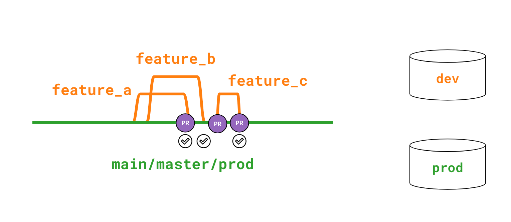
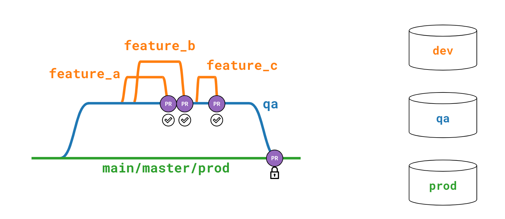
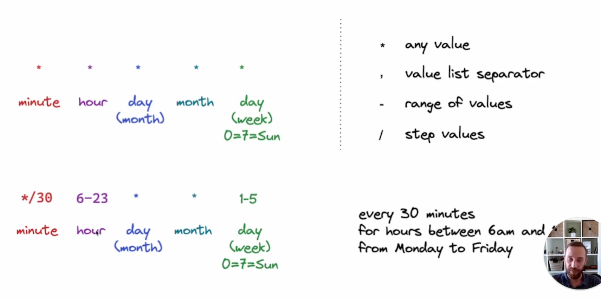
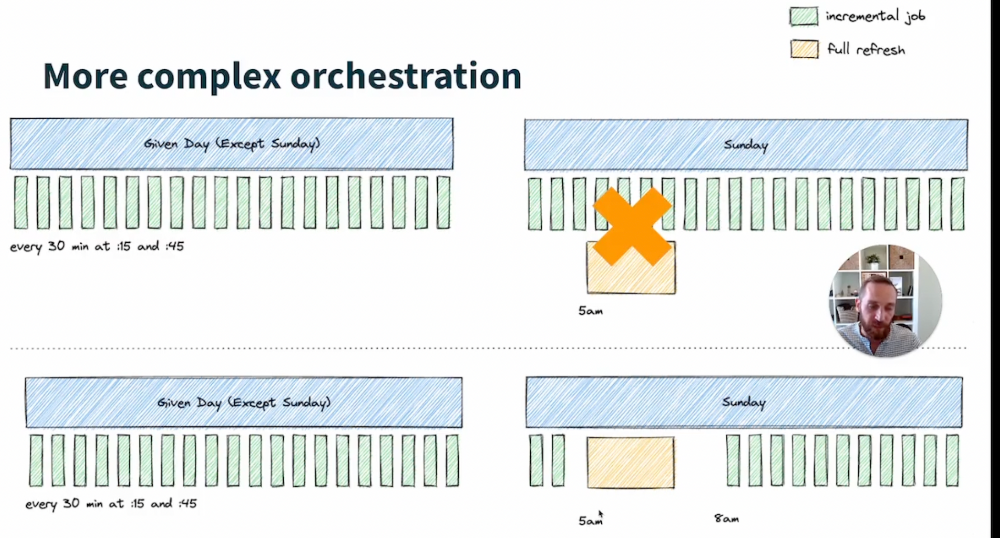
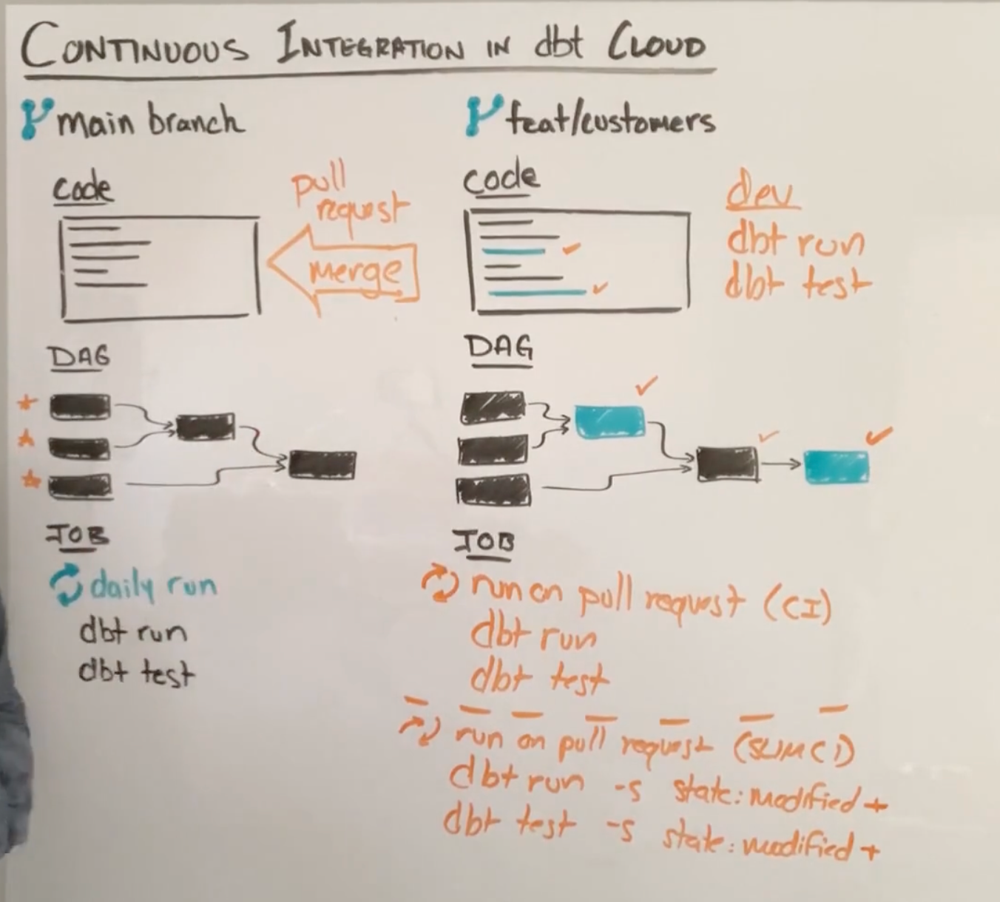

# DBT Deployment

## what is the key components for Environment level data project

1. dbt version 
2. git branch 
3. data location 

## What is a dbt cloud job

DBT deployment (level 1 ) -> DBT Jobs (level under dbt deployment)

DBT Jobs can have 
- sequence of dbt commend: dbt run / dbt test / dbt build 
- scheduled or triggered 

## What is the dbt cloud run 

DBT deployment (level 1 ) -> DBT Jobs (level under dbt deployment) -> (level under dbt job)

- run is an instantiation of DBT Job, you can see the run status in realtime
- once done, you can check the result (log) and artifacts (docs / DW tables,views)

## what is the two most common deployment architectures

One Trunk Promotion (direct)

feature branch directly to main/master branch 

- Developer branch off of the main branch.
- After developing, they open a pull / merge request.
- This kicks off a CI job that builds and tests the dbt code in a temporary PR schema.
- After code review and CI checks pass, the code can merged into main.

Many Trunks Promotion (indirect)

1. feature branch directly to intermediate branch for more testing 
2. and then intermediate branch merge to main/master branch 

- Developer branch off of the qa branch
- After developing, they open a pull / merge request against the qa branch
- This kicks off a CI job that builds and tests the dbt code in a temporary PR schema.
- After code review and CI checks pass, the code can merged into qa.
- The core owner then manages the merging of code from qa to the main branch through another CI process.

Pros and Cons 

- Trunk1 is the recommended approach for most use-cases as it allows changes to code to be quickly moved to production, with confidence that they can be trusted.
- Trunk2 might slow down the time for getting new features into production.

https://www.getdbt.com/blog/adopting-ci-cd-with-dbt-cloud/

## DBT DAG 

- understand how to navigate the Docs Lineage graph (green(source), orange(exposure), blue(model, seed, snapshot))
- how to select exclude nodes
- how to use DAG to decide how many threads are required

## DBT typical deployment / job 

Standard Job 

- typically daily job 
- build entire project with incremental logic
- target for efficiency and SLA

Full refresh Job 

- typically weekly job
- rebuild the entire project
- rebuild incremental model from scratch to make it more accurate (data late arrival)

Time sensitive Job 

- refresh models to keep the specific type of business with latest data
- subset of DAG

Fresh rebuild 

- check if the sources is updated 
- rebuild the downstream models affected by the update
- `dbt build --select source_status:fresher+`

## How to select DBT models to build together and avoid duplicate build?

use union or intersection of selection to consolidate the build models 

- tags for select 
- subfolder for select certain business domain 
- e.g. marketing models, sales models, product models 

one idea to unify hourly and daily task/table:

- tags model with frequency (daily / hourly/ 30min)
- we can setup orchestration to invoke the build according to the frequency (templating variables for idempotency)
- the storage we can use delta lake /hudi table with versions aware (staging tables) OR YYYYmmddhh partitioned table for traceability 

TODO

## Information stored for Build job 

- status of run 
- run log and debug log (debug log includes every SQL command executed for a dbt command)
- model timing (model performance metrics)
- artifacts 
    - Documentation (if configured)
    - Source freshness (if configured)

## Cron format 

## 3 ways to trigger DBT build job 

- scheduled (e.g. cron)
- webhook / API 
    - webhook can be github / gitlab related events (PR, Merge etc)
    - API (only valid to dbt cloud)

## orchestrate muliples tasks together 

1. simple orchestration: there is no overlapping between different jobs (regular vs full refresh job)

2. complex orchestration: there is overlapping on two different jobs (regular vs full refresh job)

split the regular job into windows exclude full fresh job window, so that they are not manipulating the table objects at the same time.

## DBT different Environemt, different behaviors 

- macro `generate_schema_name` is depends on target.schema / custom schema 
- limiting number of rows in different envs 
- chaning the severity of test in different envs

this can be done by: 

1. leverage `target`'s name in dbt  (`target.name` as default if not set)
2. use dbt environment variables 

## DBT environment variables precedences 

There are four levels of environment variables:

1. the optional default argument supplied to the env_var Jinja function in code
2. a project-wide default value, which can be overridden at
3. the environment level, which can in turn be overridden again at
4. the job level (job override) or in the IDE for an individual dev (personal override)

## DBT continuous integration 

- master branch: daily scheduled run
- feature branch -> master branch
    - dbt run / dbt test for all models using CI
    - slim CI only run on changed models and downstreams `dbt run -s state:modified+`

