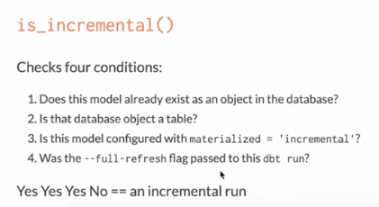

# DBT Materialization

## What are the five materialization in DBT

1. view (default)
2. table 
3. ephemeral 
4. incremental 
5. snapshot

## how does view and table materialization work in DBT

`create or replace view xxx as ()`

`create or replace table xxx as ()`

## how does ephemeral how does view and table 

- don't exist in database 
- repeated snippet as CTE and used by calling ref to the ephemeral model

cavete:

- `select * from ephemeral_model` will have database error, as it doesn't exists in the DB

## Tradeoff of view / table / ephemeral 

- speed：ephermal (fast) / view (intermediate) / table (take the longer time)
- storage: ephermal (no data stored) / view (no data stored) / table (rebuild data every time)
- compute: ephermal (similar to view) / view (recalculate every time) / table(use table's persisted result)

## what is the incremental model in DBT

if history data doesn't change, and the transformation done on historical data shouldn't be done over and over again. (e.g log data, di/hi tables)
benefits: you save time and money

## How to make incremental model in DBT

- `materialized='incremental'`
- how to identify new rows?
    - event time > max(event time) of existing table
    - run the filter only when incremental runs ``
    - `{{ this }}` refer to the model itself

## Some thinking over incremental model 

- https://courses.getdbt.com/courses/take/advanced-materializations/lessons/30195285-incremental-models
- https://discourse.getdbt.com/t/purpose-of-dbt-being-idempotent-for-when-data-grows-large/3144/5
- https://discourse.getdbt.com/t/understanding-idempotent-data-transformations/518
- https://discourse.getdbt.com/t/on-the-limits-of-incrementality/303

## Tips on DBT Materialization 

1. starts with view; when it takes too long, change to table; when it takes too long to build, switch to incremental.
