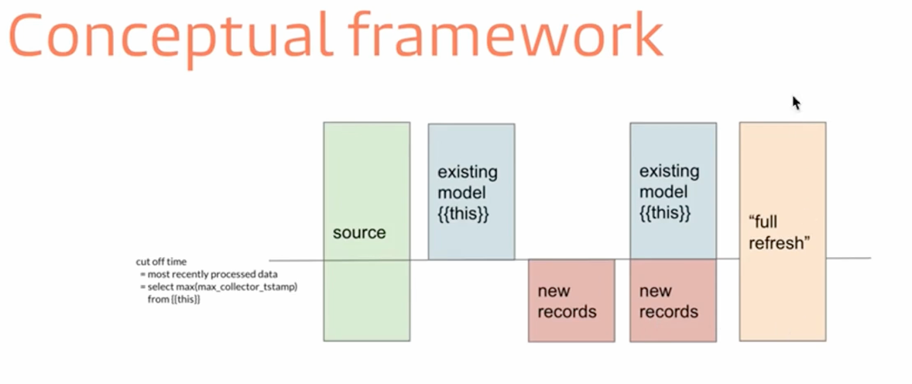
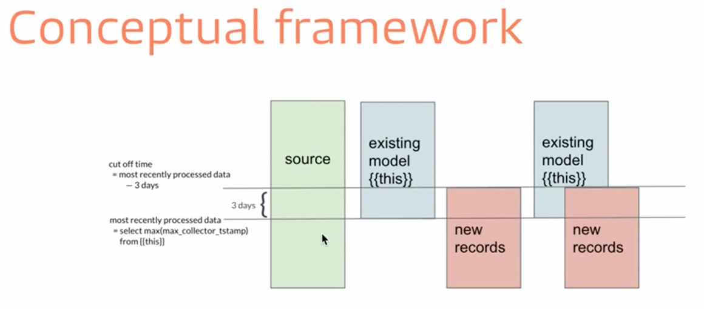
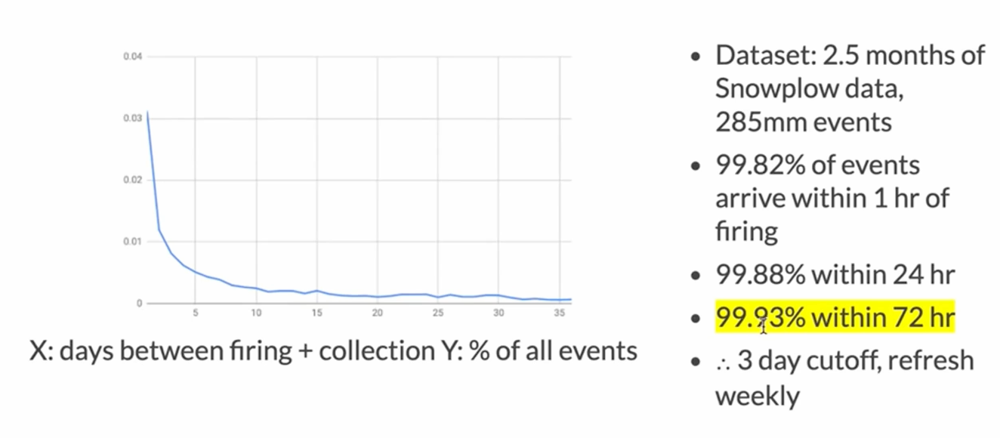

# DBT Materialization

## What are the five materialization in DBT

1. view (default)
2. table 
3. ephemeral 
4. incremental 
5. snapshot


## how does view and table materialization work in DBT

`create or replace view xxx as ()`

`create or replace table xxx as ()`


## how does ephemeral VS view and table 

- don't exist in database 
- repeated snippet as CTE and used by calling ref to the ephemeral model

cavete:

- `select * from ephemeral_model` will have database error, as it doesn't exists in the DB


## Tradeoff of view / table / ephemeral 

- build speed：ephermal (fast) / view (intermediate) / table (take the longer time)
- storage: ephermal (no data stored) / view (no data stored, compute logic is stored) / table (data sotred in DB, rebuild data every time)
- compute needed when query: ephermal (similar to view) / view (recalculate every time) / table(use table's persisted result)

## what is the incremental model in DBT

if history data doesn't change, and the transformation for historical data shouldn't be done over and over again. (e.g log data, di/hi tables)
benefits: you save time and money

## How to make incremental model in DBT

- `materialized='incremental'`
- how to identify new rows?
    - event time > max(event time) of existing table
    - run the filter only when incremental runs ``
    - `{{ this }}` refer to the model itself


## Some thinking over incremental model 

- https://courses.getdbt.com/courses/take/advanced-materializations/lessons/30195285-incremental-models
- https://discourse.getdbt.com/t/purpose-of-dbt-being-idempotent-for-when-data-grows-large/3144/5
- https://discourse.getdbt.com/t/understanding-idempotent-data-transformations/518
- https://discourse.getdbt.com/t/on-the-limits-of-incrementality/303


## incremental model concept framework



- full-refresh is like a 1st full table run 
- incremental run is combined with historical run to simulate the full table run (approximate)

what to do with late arrival data:

1. full-refresh run to correct the missing late arrival data
2. extend/increase the cut-off date, so we can include late arrival data. (e.g. 3days window)

extended windows (e.g. 3days) has an issue, there are overlapping records, which will result in duplicate if we just insert into.
we need to use merge (upsert) for idempotency by `unique_key` configuration. (without `unique_key` insert into, with `unique_key` merge/upsert)



## How to choose incremental model cutoff date?

use statistical mehtod, 

- analyze the arrival time statistics of the data 
- time tie to the data: event time / processing time / arrival time (processing time - arrival time 99.9 percentile e.g.) 




## How to handle window function affected by incremental cutoff 

the key of incremental is using cutoff to separate data into old and new chunks. It may be mutal exclusive or overlapping.
Whichever, window function may be affected due to the sepration of cutoff line. 


## When to use incremental model

good candidate

- data that is immutable, e.g. log data / traffic log 
- data updated with reliable update_at timestamp e.g. order data


## What is snapshot in DBT? 

dbt snapshot is the implementation of SCD Type2. It captures the data changes on a regular scheduling. 

extra columns used 

- `dbt_valid_from`
- `dbt_valid_to`
- `dbt_updated_at`
- `dbt_scd_id`

to detect the changes, we have two strategies

1. timestamp: `update_at`
2. check: `check_cols`


```
    {{
        config(
          target_schema='snapshots',
          strategy='timestamp',
          unique_key='id',
          updated_at='updated_at',
        )
    }}


    {{
        config(
          target_schema='snapshots',
          strategy='check',
          unique_key='id',
          check_cols=['status', 'is_cancelled'],
        )
    }}
```


## Key differences of Snapshot VS Model 

scenario 1: 

1. snapshot or SCD type2 data capturing, we want to treat it more like raw source data. 
(because we don't want to lose data/ never full-refresh), this also means that we want minimal transformation on snapshot as well.

2. we want to put the data into target database, schema differently than model schema to avoid mistakenly drop the snapshot data

scenario 2:

snapshot the metrics at the end of the data pipeline. if the board report is very important, and we want to keep track of the numbers we have reported.
so that we know what we have reported at when. SCD Type 2 can help.


## Tips on DBT Materialization 

1. starts with view; when it takes too long, change to table; when it takes too long to build, switch to incremental.
