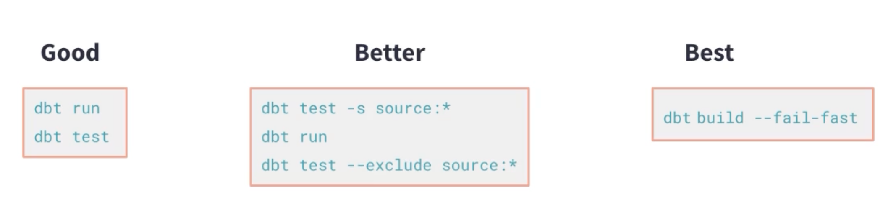
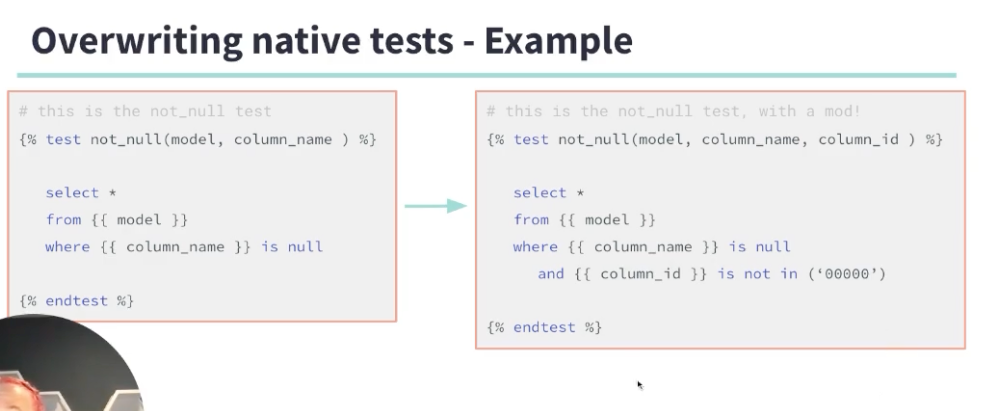

# DBT Test 

## what command involved test

`deb test` and `dbt build`

## Testing strategy 

- testing on schedule: automatic / on schedule / testing should be fast / reliable / informative (leading you to what to focus) / be focus (know what to fix, isolated)

- take action: when test failed, you should know what to fix 


## what to test about your data 

1. something true about your data: unique / not null / accepted_value / relationship
2. business logic / edge case about data: singular test 
3. table row relationship (avoid fanout (cartesian product))
4. testing freshness of source 


## when to test 

in development:

- manual 

in deployment:

- automated


in PR to Master Branch 

- CI `dbt build --model state:modified+`
- build the models changed


in QA branch to Master branch

- CI `dbt build`
- pass -> merget to master / failed to fix 


## DBT Test command 

- `dbt test`
- `dbt --select model_name_s_tests` # including generic / singular tests related to a model
- `dbt --select folder1.folder2.*` # including all tests related to models in subfolder
- `dbt test --select test_type:generic/singular`
- `dbt test --select source:*` # all tests related a sources


- `dbt test --select selector1,selector2` # use comma for intersection
- `dbt --select package.*`


## DBT Test Commands - best practice 

`dbt build --fail-fast`



## DBT Test - store test failures 

`dbt test --store-failures` 

for efficient troubleshooting
when the test failed, the result will be saved on a test schema table in the data warehouse. 


## DBT generic test 

- location: `dbt_project/tests/generic/xxx.sql`
- function signiture 

```



```


## DBT override default generic test 

you can override default generic test simply by defining your own generic test logic with same name




## What is a singular test 

- A singular test is a SQL SELECT statement that makes an assertion in reference to a specific model and its specific columns. 
- Singular tests are sql files that live in the tests folder and use the ref function to call a specific model. 


## how to enable and disable singular test 

`{{ config(enabled = False/ True) }}`

