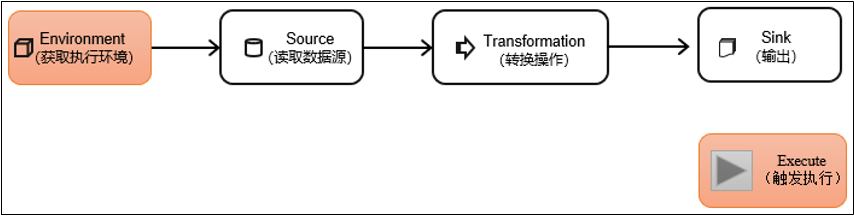
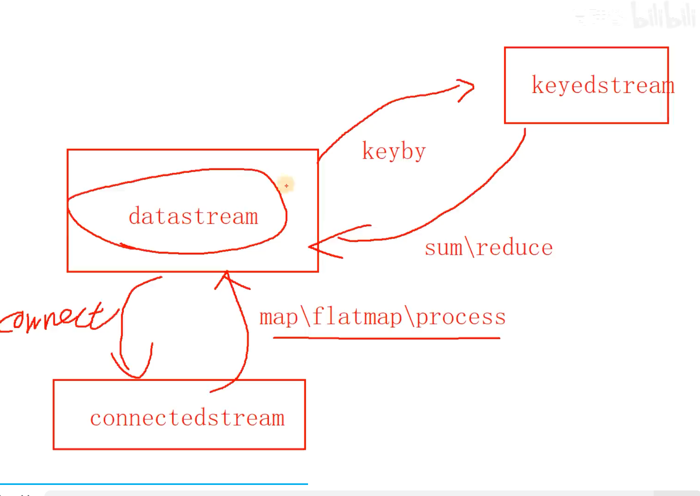

# Flink DataStream API


## Flink DataStream API overview



get execution environment (config if any) -> setup data source -> transformation logic -> setup sink -> call env.execute() to start job


## Flink DataStream API Get Execution Environment

flink has two types of execution environment

1. local (mini mock cluster)
2. remote cluster


local or remote: getExecutionEnvironment 可配置参数或使用默认参数

```
StreamExecutionEnvironment env = StreamExecutionEnvironment.getExecutionEnvironment();
```


Remote 定制执行环境，上传jar包运行

`env = StreamExecutionEnvironment.createRemoteEnvironment(host, port, jarFilePath);`

```
import org.apache.flink.streaming.api.environment.StreamExecutionEnvironment;

public class Main {
    public static void main(String[] args) throws Exception {
        String host = "localhost";
        int port = 6123;
        String jarFilePath = "/path/to/your/jarfile.jar";

        StreamExecutionEnvironment env = StreamExecutionEnvironment.createRemoteEnvironment(host, port, jarFilePath);

        // Your Flink job code here...

        env.execute("Flink Streaming Job");
    }
}
```

## Flink environment Batch VS Streaming mode

flink 支持流批一体，可以通过 指定运行模式切换

```
// in program 
env.setRuntimeMode(RuntimeExecutionMode.BATCH);
env.setRuntimeMode(RuntimeExecutionMode.STREAMING);

# CLI config
bin/flink run -Dexecution.runtime-mode=BATCH ...
```


## Flink DataStream API execute VS executeAsync()

- `env.execute()` 是 block执行的。 因为流不会停止
- `env.executeAsync()` 是非阻塞的，如果希望写在同一个文件中的，多个 `execute` 异步执行


## Flink Source Overview

- flink 早期版本 `addSource()`
- flink 1.12 流批一体 新版本 `fromSource(source object)`

flink source 主要有

- from sequence / element
- from file source
- from socket source
- data generator
- Kafka


## Flink DataStream API - Source

template for flink source

```
StreamExecutionEnvironment env = StreamExecutionEnvironment.getExecutionEnvironment();

// 1. create different sources here: file / datagen / socket / kafka 

// 2. put source to formSource interface
DataStreamSource<String> source = env.fromSource(xx_source, WatermarkStrategy.noWatermarks(), "source name");

source.print();
env.execute();
```

1. from java collection

```
DataStreamSource<Integer> source =  env.fromElements(1,2,3);
DataStreamSource<Integer> source =  env.fromCollection(Arrays.asList(1,2,3));
```


2. from file as stream, dependency `flink-connector-files`

```
// FileSource API
FileSource<String> fileSource = FileSource.forRecordStreamFormat(
        new TextLineInputFormat(),
        new Path("input/words.txt")
).build();
```

3. from network socket (unbounded)

```
// socket IP and port
DataStreamSource<String> source = env.socketTextStream("localhost", 7777);
```

4. from data generator for mock data, dependency `flink-connector-datagen`

```
// DataGeneratorSource API 
// 1. DataGeneratorFunction
// 2. Long max count 数量，如10  / 10000
// 3. Rate limit 
// 4. TYPES.xxx 返回类型

DataGeneratorSource<String> dataGeneratorSource = new DataGeneratorSource<>(xxx)
DataStreamSource<String> source = env.fromSource(dataGeneratorSource, WatermarkStrategy.noWatermarks(), "DateGen");
source.print();
```

5. from Kafka dependency `flink-connector-kafka`

```
// KafkaSource API 
KafkaSource<String> kafkaSource = KafkaSource.<String>builder()
    .setBootstrapServers("hadoop102:9092")
    .setTopics("topic_1")
    .setGroupId("atguigu")
    .setStartingOffsets(OffsetsInitializer.latest())
    .setValueOnlyDeserializer(new SimpleStringSchema()) 
    .build();

```


## Flink DataStream API - Source Data Types

Flink 类型系统: 实现了 序列化，反序列化 及比较器

```
import org.apache.flink.api.common.typeinfo;

TypeInformation

Types.xxx 会构造返回 TypeInformation 类型
```


当返回类型，推断不准确时，如 lambda function, 可以显示指定类型

```
DataStreamOperator.returns(TypeInformation)
e.g. SingleOutputStreamOperator.returns(Types.TUPLE(Types.STRING, Types.INT))
```


Flink support POJO 类型要求

1. public class
2. has default constructor (no arguments)
3. attributes are public accesible (public attributes / public getter,setter)
4. attributes are serializable


Flink支持的数据类型

- 基本类型: 所有Java基本类型及其包装类
- 数组类型
- 复合数据类型: java TUPLE, flink TUPLE, scala TUPLE, Tuple0~Tuple25，不支持空字段, ROW, POJO
- other: List / Map / Option / Either


## Flink Data Stream API - Transformation

- map: 一进一出
- flter: 根据 true/false 条件过滤
- flatMap:  一进多出

```
source.map(value -> value.getId()) // lambda
source.map(new MapFunction() { override map interface } ) // implement logic in MapFunction 

source.filter()

source.flatMap()
```


## Flink Data Stream API - Keyby

- KeyBy, 分组，指定 key 后， 相同的key 后落在同一机器
- KeyBy 返回 KeyedStream 与 Operator 不同（可以 `setParalelism`）

```
stream.keyBy(new KeySelector<>(xxx))
```

KeyedStream 可以按照分组进行聚合:

- min / max / sum / minBy / maxBy (minBy, maxBy 取最大值，非比较字段也取最大值对应的记录)
- `min(position)` or `min("str_field_name")`

```
keyedStream.min/max/sum
```


KeyedStream 可以按照分组 两两聚合

- reduce

```
keyedStream.reduce(new ReduceFunction<>(xxx))
```


## Flink DataStream API - 两种按口使用方式

1. implement interface
2. 继承 abastract class, 并实现 abstract function


MapFunction

- implement interface `map`

RichMapFunction

- abstract funciton `map`
- 多了生命周期function: `open()`, `close()`
- 多了获取 runtime context 的办法

## Flink DataStream API - Shuffle with partition

- random
- rebalance / round robin
- rescale (round robin locally within subgroup)
- broadcast
- hash (keyBy)
- global (all send to task 0)
- forward (one-to-one)
- customized


```
// random 
stream.shuffle()

stream.rebalance()
stream.rescale()
stream.broadcast()
stream.global()
```

custom partition

```
stream.partitionCustom(new Partitioner(), new KeySelector())
```


## Flink DataStream API - 分流

1. 主流 通过 filter 过滤，形成新的流 （如果主流被过滤多次，处理的主流 流量会加倍，性能下降）
2. process， 主流切分多个流 （主体处理的流量是固定的）

    - 主流: `collector.collect()`
    - 侧流: `ctx.output()`
    - processStream是主流
    - process.getOutput 从主流中获取侧流， by tag

```
stream.process(new ProcessFunction() {

})
```

## Flink DataStream API - 合并流

- union of two / more streams (流的元素类型必须相同)
- 连接流:connect two streams (流的元素类型可以不同)

union

```
DataStreamSource<Integer> source1 = env.fromElements(1, 2, 3);
DataStreamSource<Integer> source2 = env.fromElements(11, 22, 33);
DataStreamSource<String> source3 = env.fromElements("111", "222", "333");

source1.union(source2, source3.map(val -> Integer.valueOf(val))).print();
source1.union(source2).union(source3.map(val -> Integer.valueOf(val))).print();
```

connect stream

```
ConnectedStreams<Integer, String> connect = source1.connect(source3);
connect.map(new CoMapfunction<T1, T2, OUT>() {

    // map1 of T1
    // map2 of T2
} )
```

connected stream 多流匹配时， e.g. join, 需要用关联字段做keyBy, 这样多个机器（多并行度）时，
同一样分区的数据会发送到同一个机器，保障结果是正确的。


## Flink DataStream / KeyedStream / ConnectedStreams 转换





## Flink DataStream API 中 XXXFunction 匿名类 VS Lambda Function

- Lambda 会存在类型 擦除，导致 类型推断失效
- Lambda 会存在类型 擦除，Serializatin 序列化 效率低下

- Lambda 表达式的可读性更高，functional programming 概念更强

- https://blog.51cto.com/alanchan2win/8639948
- https://juejin.cn/post/6844904176963551239
- https://blog.csdn.net/fu_huo_1993/article/details/103108847


## Flink DataStream API - Sink

- flink 早期版本 `addSink()`
- flink 新版本 `sinkTo(sink object)`

connector 有些支持 source / sink, 需要确认
https://nightlies.apache.org/flink/flink-docs-release-1.17/docs/dev/datastream/overview/


## Flink DataStream API Debug with local WebUI

create local env with configurations

```
Configuration conf = new Configuration();
conf.set(RestOptions.BIND_PORT, "8082");
StreamExecutionEnvironment env = StreamExecutionEnvironment.createLocalEnvironmentWithWebUI(conf);
```

add dependency `flink-runtime-we`

```
<dependency>
    <groupId>org.apache.flink</groupId>
    <artifactId>flink-runtime-web</artifactId>
    <version>${flink.version}</version>
</dependency>
```

## Docs

- https://javadoc.io/doc/org.apache.flink/flink-streaming-java/1.17.0/index.html
- https://nightlies.apache.org/flink/flink-docs-release-1.17/

- [Flink tech blog](https://blog.csdn.net/chenwewi520feng/article/details/131530503)

## Java data structure used in Flink


`java.util.Collection`

`java.util.Arrays`

`java.TUPLE`

java lambda function
